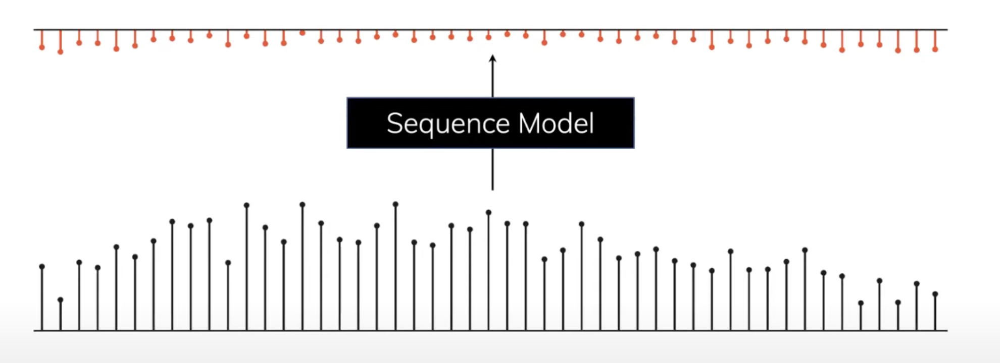
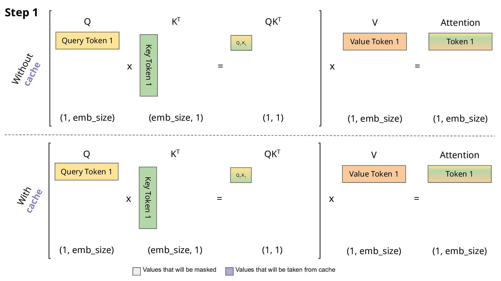

# Mamba: Zero to Hero

## Contents:

- Sequence Modelling
  - Sequence modelling in different architecutres & their corresponding problems
- State Space Models
  - What are SSM & its components
  - Discretization from fundamentals
  - Recurrent & Convolution computation
- **Mamba**: A **selective** State Space Model (SSM)
  - Why Mamba?
  - Selective Scan & corresponding optimizations
  - Model Architecture
  - Benchmarks
  - Shortcomings

# **1.0. Sequence Modelling**

- Mapping an **input sequence** to the **output sequence**

### 1.1 **What kind of data is used?**

## 1.2 <u>Transformers</u>

$$
Attention(Q,K,V) = softmax(\frac{QK^T}{\sqrt{d_k}})V
$$

- Limited context length
- Training: $O(N^2)$ + Parallizable architecture 
- Generation: $O(N^2)$ but with KV Cache it gets to $O(N)$ + extra memory head / per token
- 

## 1.3. <u>RNN/LSTM</u>

$$
h_{t} = g_1(\bar{A}h_{t-1} + \bar{B}x_t)\\
y_{t} =  g_2(Ch_{t})
$$

- Theoretically: Infinite Context length
- Training: $O(N)$ + Non-parallizable architecture
- Generation: $O(1)$ (constant) for each token
- Vanishing/exploding gradient

## 1.4 <u>Overall Issues</u>

- Limited Context Window
- Non-parallizable model training and quadratic/sub quadratic Inference time
- Low performance architectures (RNN/LSTM)

# **2.0. Linear RNN**

$$
h_{t} = \bar{A}h_{t-1} + \bar{B}x_t\\
y_{t} =  Ch_{t}
$$

## 2.1 <u>Training</u>

At T = 0:
$$
h_0 = \bar{B}x_0\\
y_0 = Ch_0 = C\bar{B}x_0
$$
At T = 1:
$$
h_{1} = \bar{A}h_{0} + \bar{B}x_1 = \bar{A}\bar{B}x_0 + \bar{B}x_1\\
y_{1} =  Ch_{1} = C\bar{A}\bar{B}x_0 + C\bar{B}x_1
$$
At T = 2:
$$
h_{2} = \bar{A}h_{1} + \bar{B}x_2 = \bar{A}^2\bar{B}x_0 + \bar{A}\bar{B}x_1 + \bar{B}x_2\\
y_{2} =  Ch_{2} = C\bar{A}^2\bar{B}x_0 + C\bar{A}\bar{B}x_1 + C\bar{B}x_2
$$
Generalizing the above pattern:
$$
y_k = C\bar{A}^k\bar{B}x_0 + C\bar{A}^{k-1}\bar{B}x_1 + ... + C\bar{A}\bar{B}x_{k-1} + C\bar{B}x_k
$$

### <u>**2.1.1. Convolution Operation**</u>

This is interesting, given the formula above it can be computed using convolution operation over input $x(t)$. We can define the 1D kernel $\bar{K}$ and output $y$ as:
$$
\text{Kernel } (\bar{K}) = (C\bar{B}, C\bar{A}\bar{B}, ..., C\bar{A}^k\bar{B}) \\ 
y = x * \bar{K}
$$

This 1D convolution operation is paralliziable, since the value of $\bar{K}$ is fixed, it can be easily pre-computed. 

> - Value of  $\bar{K}$ is fixed because RNN uses the same parameter matrix for all tokens
> - The linear kernel convolution on data is O(N) but doing it in Fourier space it is just multiplication O(NlogN) + internal accelerators optimization

**2.2. Summary**

- Training Speed: Fast (Paralleliazable Convolution)
- Generation Speed: Fast (Constent per token, due to recurrence inference)
- Accuracy: Very Poor (Barely learns)

# **3.0. State Space Models (SSM, S4)**

## 3.1. <u>SSMs and where they came from?</u>

<u>**General**</u>:

- Concept of SSMs are taken from the "Control System" field,  The core idea of state-space systems is to represent a system's *dynamics*. This means capturing how the system changes over time. 

- Many physical systems we model (electrical circuits, mechanical systems, chemical processes) operate in continuous time.

- 

- State Space Equations are given as:

- $$
  \frac{dx}{dt} = Ax(t) + Bu(t) \\ 
  y(t) = Cx(t) + Du(t)\\
  $$

  **A, B, C** and **D** are the learnable parameters, **D** can be ignored here (consider as 0) since from the architecture point of view it is nothing but a skip-connection

<u>**Sequence Modelling**</u>

- SSMs are a continuous variant of Linear RNN block

- They model the state of tokens in sequence

- They are Linear and can be Time Invariant (S4) or Time Variant (S6/mamba)

- Desgined specially for handling long context

- $$
  \frac{dh}{dt} = Ah(t) + Bx(t) \\ 
  y(t) = Ch(t)\\
  $$

## <u>3.2. Fundamentals of Discritization</u>

- We deal with descrete data, so need to map continuous state space to descrete.
- Looking on the equation only the parameter **A** and **B** influence the state **h**, so they need to be converted.
- 

On the very fundamental level, we can write:
$$
\lim_{\Delta \to 0}\frac{h(t + \Delta) - h(t)}{\Delta} = \frac{dh}{dt}
$$
We can approximate the value of $h(t+\Delta)$ by choosing a small time step $\Delta$ as:
$$
h(t+\Delta) \cong h'(t)\Delta + h(t) \\ 
\text{From the State space equation}\\
h(t+\Delta) = h(t)(I + \Delta A) + \Delta Bx(t) \\
h(t+\Delta) = \bar{A}h(t) + \bar{B}x(t)
$$
In the paper, authors used **Zero-Order Hold** (ZOH) rule to discretize the system, but the intent is same

Now our system has 4 Parameters **($\Delta$, A, B, C)** , lets see what each of them represents.
$$
h_{t} = \bar{A}h_{t-1} + \bar{B}x_{t} \\ 
y_t = Ch_{t}\\
$$

- <u>$\Delta$</u> Represents the time step or the discretization interval in discrete-time models.
- <u>**A**(State Transition Matrix)</u>: Describes how the current state of the system influences its next state. 
- <u>**B**(Control/Input Matrix)</u>: Maps how external inputs or control actions affect the state of the system.
- <u>**C**(Output Matrix)</u>: Relates the internal state of the system to the outputs or observations that can be measured. 

## <u>3.3. Importance of Matrix A</u>

- Recalling the Exponential Moving Average as:

  - $$
    h_{t} = (1- \alpha) h_{t-1} + \alpha x_{t} \\
    $$

    

- Context representation for sequence modelling
  - 
  - 
  - Basically gives a lower triangluar matrix structure ( **initialization based on the** **HiPPO** **matrix**)
  - 
  - This matrix is not normal, but it can be decomposed as a normal matrix plus a matrix of lower rank.

## <u>3.4. Convoluition operation</u>

We need to notice that our parameters **($\Delta$, A, B, C)** are time invariant $(\Delta, A, B, C) \to (\bar{A}, \bar{B}, C)$
$$
h_{t} = \bar{A}h_{t-1} + \bar{B}x_{t} \\ 
y_t = Ch_{t}\\
$$
As per the computation, we can use the same convolution trick (discussed in Linear RNN) to effectively compute all the hidden states per token of an input sequence
$$
\text{Kernel } (\bar{K}) = (C\bar{B}, C\bar{A}\bar{B}, ..., C\bar{A}^k\bar{B}) \\ 
y = x * \bar{K}
$$

# **4.0. Mamba (Improving S4 to S6)**

## 4.1. The Objective

- SSMs lacks the performance on Sequence modelling on dense modalities (language and genomics)

- Time Invariant parameters does not allow information selection

- SSM lack content-aware reasoning

- Attention explicitly does not compress context at all.

- Synthetic Tasks:

  

  

## <u>4.2. Selective SSM (S6)</u>

- **Selective Nature** is only allowed to **$(\Delta, B, C)$** 
- **Selective Interpretation of $(\Delta, A, B, C)$ parameters:**
  - $\Delta$: It controls the balance between how much to **focus** or **ignore** the current input $𝑥_t$. SSMs can be interpreted as a continuous system discretized by a timestep ∆, and in this context the intuition is that large ∆ → ∞ represents the system focusing on the current input for longer (thus “selecting” it and forgetting its current state) while a small ∆ → 0 represents a transient input that is ignored.
  - **A**: The interaction of A to the model is via $\Delta$ as $\bar{A} = exp(\Delta A)$ (Zero Hold Discretization), so selectivity in $\Delta$ is enough to ensure the selectivity of $A$
  - **B and C**: Selectivity is to filter out the irrelevant information out of context to ensure the efficient compressed state. Making $B$ and $C$ selective allows finer-grained control over whether to let an input $𝑥_t$ into the state $h_𝑡$ or the state into the output $𝑦_𝑡$
- **Issue: Parallized Convolution for computation won't work (SSM/Linear RNN)** 

### **4.2.1 Parallel Recurrence Scan (Prefix Sum Variant)**

### **4.2.2 Hardware Aware State Expansion & Kernel Fusion**

Here, the following are fused into one kernel:

- Discretization step with *step size* **∆**
- Selective scan algorithm
- Multiplication with *C*

### **4.2.3. Recomputation**

During backpropagation, in order to calculate the gradients at each node, we need to cache the output values of the forward step. Since caching the activations and then reusing them during back-propagation means that we need to save them to the HBM and then copy them back from the HBM during backpropagation, it may be faster to just recompute them during backpropagation.

## <u>4.3. Architecutre</u>

- Mamba relaxes the time invariant property of S4
- SSMs are linear operation blocks, because of the linearity, backprop through time is reportedly more stable for Mamba than for e.g., LSTM (no activation function to squash signals to zero)
-  There's nonlinearity in the outputs and in the gates. 
- Convolution  operation on expanded input emdeddings is to prevent the independent token calculation

Very similar to Decoder architecture, multiple Mamba blocks can be stacked as shown:

## <u>4.4. Benchmarks</u>

<u>**4.4.1 Performance of Proposed Synthetic tasks**</u>

<u>**4.4.2. Performance of Language Modelling (GPT3 reciepe & trained on Pile Dataset)**</u>

## <u> 4.5. Short Comings</u>

- Selective scan can overcome the weakness with descrete modalities (text, DNA) but this conversly can impede the performance on data that LTI system excels on (audio)

- [Repeat After Me: Transformers are Better than State Space Models at Copying](https://arxiv.org/abs/2402.01032)

---

> References Papers:
>
> 1. [Mamba: Linear-Time Sequence Modeling with Selective State Spaces](https://arxiv.org/pdf/2312.00752.pdf)
> 2. [Efficiently Modeling Long Sequences with Structured State Spaces](https://arxiv.org/pdf/2111.00396.pdf)
> 3. [Simplified State Space Layers for Sequence Modeling](https://arxiv.org/abs/2208.04933)
> 4. [Repeat After Me: Transformers are Better than State Space Models at Copying](https://arxiv.org/abs/2402.01032)

<h1><strong>Thank You!</strong></h1>
